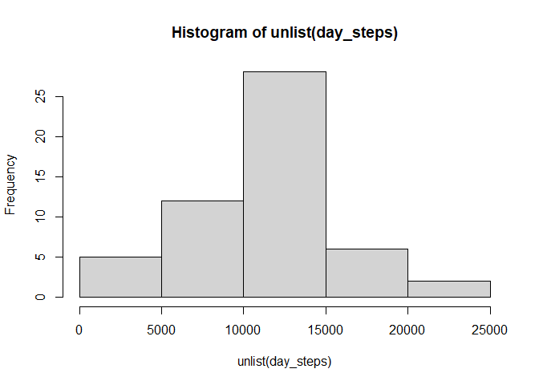
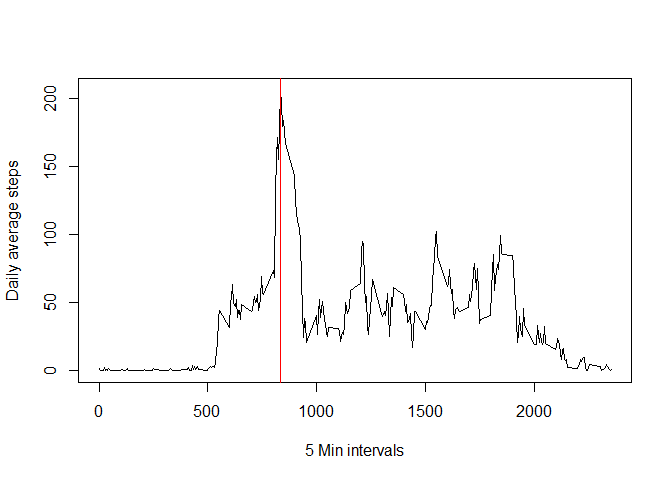
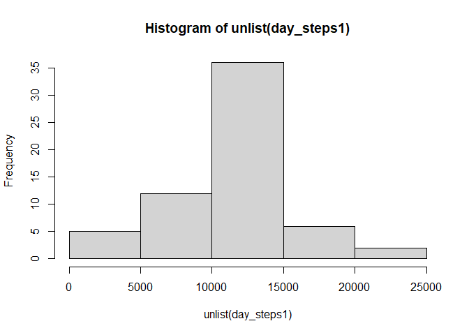
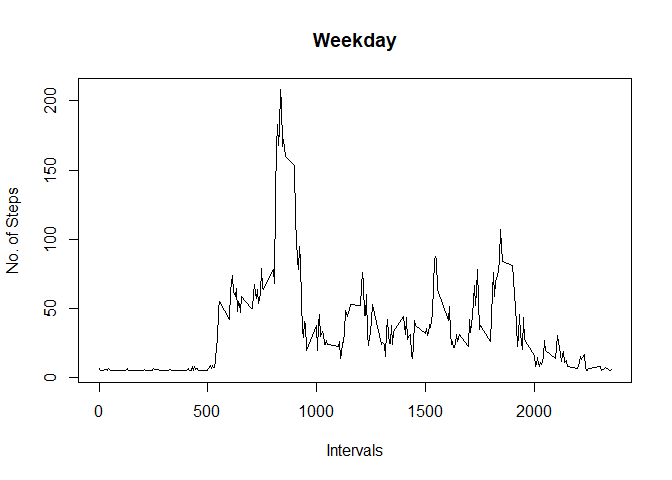
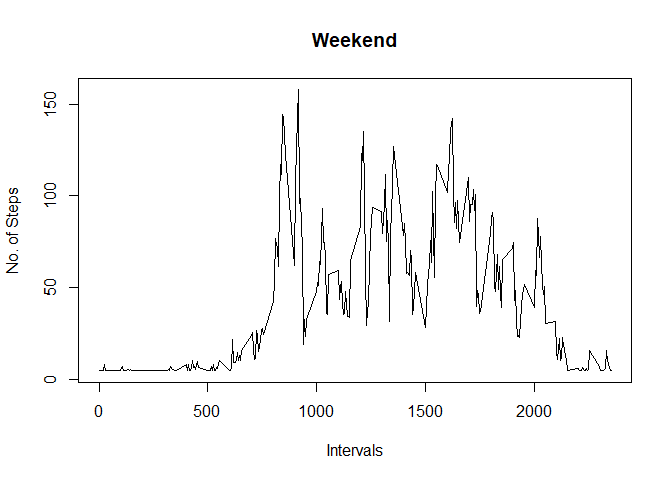

## Loading and preprocessing the data
1. Read data from the activity cvs file. 
2. Replace rows with the steps with NA value 


```r
activity <- read.csv(file = "./activity/activity.csv")
activity <- activity[!is.na(activity$steps), ]
```


## What is mean total number of steps taken per day?
1. Sum all the steps based on date bucket
2. Calculate the mean value
3. Calculate the median value


```r
day_steps <- tapply(activity$steps, activity$date, sum, simplify = FALSE)
hist(unlist(day_steps))
```

<!-- -->

```r
mean_val <- sum(unlist(day_steps))/length(day_steps)
median_val <- median(unlist(day_steps))
print(paste("Mean value:", mean_val))
```

```
## [1] "Mean value: 10766.1886792453"
```

```r
print(paste("Median value:", median_val))
```

```
## [1] "Median value: 10765"
```


## What is the average daily activity pattern?
1. Calculate the mean values for the steps based on interval identifier
2. Plot the graph with 5 min intervals on x axis and daily averge steps on y axis
3. Identification of max steps interval   


```r
min_steps <- tapply(activity$steps, activity$interval, mean, simplify = FALSE)
with(min_steps, plot(x = names(min_steps), y = unlist(min_steps), type = 'l', xlab = "5 Min intervals", ylab = "Daily average steps"))
max_step_interval <- as.numeric(names(min_steps[min_steps == max(unlist(min_steps))]))
abline(v = max_step_interval, col = "red")
```

<!-- -->

```r
print(paste("Max Steps:", max_step_interval))
```

```
## [1] "Max Steps: 835"
```


## Imputing missing values
1. Load the activity data in activity1
2. Calculate the missing NA count

```r
activity1 <- read.csv(file = "./activity/activity.csv")
missing_steps <- sum(is.na(activity1$steps))
print(paste("Missing steps or NA:", missing_steps ))
```

```
## [1] "Missing steps or NA: 2304"
```


3. Filling missing values with day mean
4. Create histogram for activity1
5. calculate mean and median

```r
activity1[is.na(activity1$steps), ]$steps <- mean(activity1$steps, na.rm = TRUE)
day_steps1 <- tapply(activity1$steps, activity1$date, sum, simplify = FALSE)
hist(unlist(day_steps1))
```

<!-- -->

```r
mean_val1 <- sum(unlist(day_steps1))/length(day_steps1)
median_val1 <- median(unlist(day_steps1))
print(paste("Mean value:", mean_val1))
```

```
## [1] "Mean value: 10766.1886792453"
```

```r
print(paste("Median value:", median_val1))
```

```
## [1] "Median value: 10766.1886792453"
```


## Are there differences in activity patterns between weekdays and weekends?

1. add column of days

```r
activity1 <- cbind(activity1, day = weekdays(as.Date(activity1$date), abbreviate = TRUE))

activity1_weekend <- activity1[activity1$day %in% c("Sat", "Sun"), ]
activity1_weekday <- activity1[activity1$day %in% c("Mon", "Tue", "Wed", "Thu", "Fri"), ]

weekday_min_steps <- tapply(activity1_weekday$steps, activity1_weekday$interval, mean, simplify = FALSE)

with(weekday_min_steps, plot(x = names(weekday_min_steps), y = unlist(weekday_min_steps), type = 'l', xlab = "Intervals", ylab = "No. of Steps", main = "Weekday"))
```

<!-- -->

```r
weekend_min_steps <- tapply(activity1_weekend$steps, activity1_weekend$interval, mean, simplify = FALSE)

with(weekend_min_steps, plot(x = names(weekend_min_steps), y = unlist(weekend_min_steps), type = 'l', xlab = "Intervals", ylab = "No. of Steps", main = "Weekend"))
```

<!-- -->
